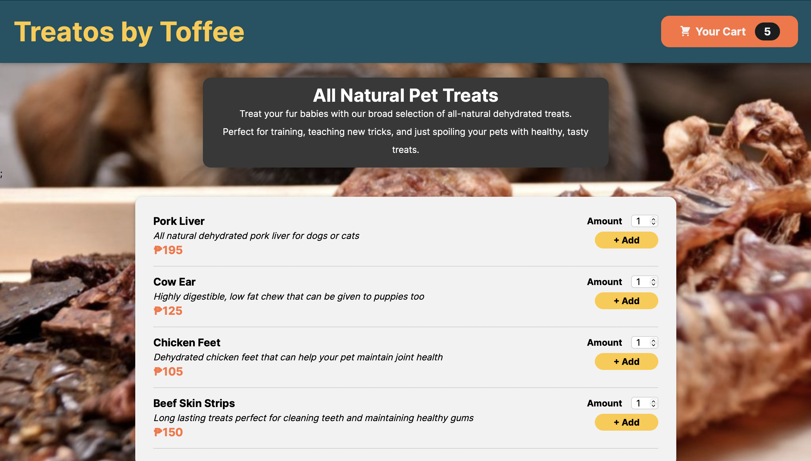

# Treatos by Toffee

A pet treat order app with a list of treats for users to choose from. Users can add/remove items to their shopping cart and see the total amount of their order.

It is a practice on React built-in hooks such as useState, useEffect, useReducer, useRef, and useContext.

Live Site URL: [https://amsandiego.github.io/treatos-shop-react/](https://amsandiego.github.io/treatos-shop-react/)

## Table of contents

- [Overview](#overview)
  - [Screenshot](#screenshot)
- [My process](#my-process)
  - [Built with](#built-with)
  - [Flow of implementation](#flow-of-implementation)

## Overview

### Screenshot

## My process

### Built with

- React
- HTML
- CSS modules

### Flow of Implementation

- First, the different components comprising the application were built. Reusable components and wrapper components such as Card and Input were also created. The Modal component used the concept of React Portals.
- Modal state was managed using useState hook.
- Overall cart data was managed thru context because it is needed in different places. A cart-context and CartProvider file are created.
- So that the context and any components affected by the context are re-evaluated whenever the cart data changes, state management is required. UseReducer was used as this is a more complex state. Two handler functions were added that each dispatch an action for adding and removing an item from the cart, respectively.
- UseEffect was used to add an animation to the cart button, executing whenever the items array changes.
